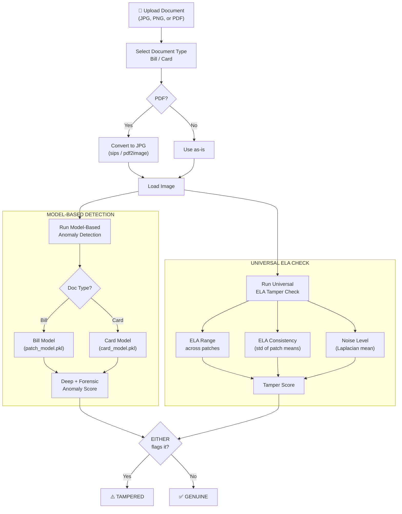
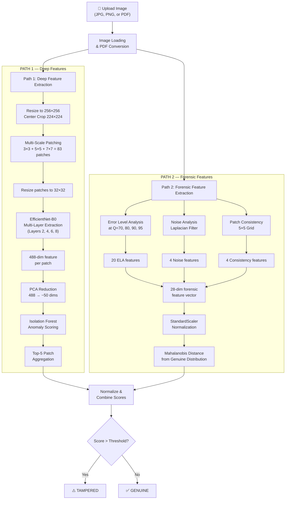
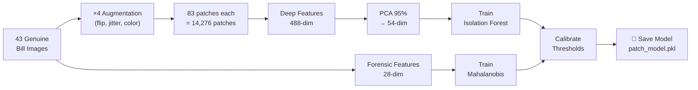
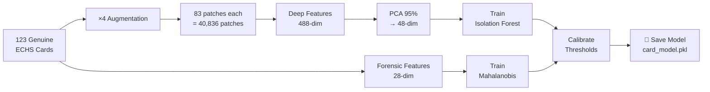

# Bill & Card Fraud Detection System — Technical Documentation

## Table of Contents

1. [System Overview](#system-overview)
2. [Architecture — Dual Model + ELA Safety Net](#architecture--dual-model--ela-safety-net)
3. [Complete Pipeline Flow](#complete-pipeline-flow)
4. [Step-by-Step: What Happens When You Upload a Document](#step-by-step-what-happens-when-you-upload-a-document)
5. [Algorithms & Methods In Detail](#algorithms--methods-in-detail)
6. [Training Pipeline](#training-pipeline)
7. [Model Architecture](#model-architecture)
8. [Performance & Accuracy](#performance--accuracy)
9. [Web Application](#web-application)

---

## System Overview

This system detects **tampered (fraudulent) documents** — both medical bills/prescriptions and ECHS cards/IDs — using a **three-layer detection approach**:

| Layer | What It Does | Algorithm | Scope |
|-------|-------------|-----------|-------|
| **Deep Feature Path** | Analyzes visual content & structure | EfficientNet-B0 → Isolation Forest | Per document type |
| **Forensic Path** | Detects compression artifacts & noise patterns | ELA + Noise Analysis → Mahalanobis Distance | Per document type |
| **Universal ELA Check** | Model-independent tampering detection | ELA range + consistency − noise level | All document types |

### Dual-Model Architecture

The system uses **separate models** for different document types because bills and cards have vastly different visual/forensic profiles:

| Model | Training Data | File | Purpose |
|-------|-------------|------|---------|
| **Bill Model** | 43 genuine bills/prescriptions | `models/patch_model.pkl` | Detects tampered bills with 100% accuracy |
| **Card Model** | 123 genuine ECHS cards/IDs | `models/card_model.pkl` | Verifies ECHS card authenticity |

> [!IMPORTANT]
> Each model is trained only on **genuine** documents of its type. The Isolation Forest and Mahalanobis Distance learn what "normal" looks like and flag anything that deviates.

### Universal ELA Safety Net

Because each model only knows its own document type, a **standalone ELA-based tampering check** runs on every upload regardless of the selected model. This catch-all layer uses:

```
tamper_score = (ela_range / 10) + (ela_consistency / 3) − (noise_mean / 5)
```

If `tamper_score > 2.4`, the document is flagged as tampered — even if the selected model's anomaly detector doesn't catch it.

---

## Architecture — Dual Model + ELA Safety Net



---

## Complete Pipeline Flow



---

## Step-by-Step: What Happens When You Upload a Document

### Step 1 — Document Loading & PDF Conversion
**File:** `app.py → convert_pdf_to_image()`, `bill_preprocessing.py → load_and_preprocess_image()`

- **PDF files** are automatically converted to JPEG images:
  - Primary method: `sips` (macOS built-in, fast)
  - Fallback: `pdf2image` Python library (cross-platform)
- The image is loaded as **RGB** using PIL
- Preprocessing is applied:
  - Resize to **256 × 256** pixels
  - Center crop to **224 × 224** (standard ImageNet input size)
  - Convert to tensor and normalize using **ImageNet statistics**:
    - Mean: `[0.485, 0.456, 0.406]`
    - Std: `[0.229, 0.224, 0.225]`

### Step 2 — Multi-Scale Patch Extraction
**File:** `bill_preprocessing.py → create_multiscale_patches()`

The image is divided into patches at **3 different scales** to capture anomalies at different granularities:

| Grid | Patches | What It Captures |
|------|---------|-----------------|
| **3×3** | 9 large patches | Broad structural anomalies (e.g., entire sections replaced) |
| **5×5** | 25 medium patches | Region-level tampering (e.g., price field edits) |
| **7×7** | 49 fine patches | Pixel-level manipulations (e.g., single digit changes) |

**Total: 83 patches** per image, all resized to **32×32** using bilinear interpolation.

> [!NOTE]
> Multi-scale analysis is crucial because tampering can occur at any granularity — from changing a single digit to replacing entire sections of a document.

### Step 3 — Deep Feature Extraction (Path 1)
**File:** `feature_extractor.py → FeatureExtractor`

Each of the 83 patches is passed through **EfficientNet-B0** (pre-trained on ImageNet). Features are extracted from **4 intermediate layers**:

| Layer Index | Channel Dims | What It Captures |
|-------------|-------------|-----------------|
| Layer 2 | 24 | Low-level edges, textures, noise patterns |
| Layer 4 | 40 | Mid-level shapes, character strokes |
| Layer 6 | 112 | High-level structural patterns |
| Layer 8 (final) | 1280 | Semantic content, document layout |

Each layer's output is **global-average-pooled** to a vector, then all 4 are **concatenated** to form a **488-dimensional feature vector** per patch.

> [!IMPORTANT]
> Multi-layer extraction is critical because tampering artifacts manifest at different abstraction levels. A copied region might look fine semantically (high layers) but have inconsistent texture patterns (low layers).

### Step 4 — PCA Dimensionality Reduction
**File:** `outlier_detector.py → AnomalyDetector.train()`

The 488-dim features are reduced using **PCA** retaining **95% of the explained variance**:
- Bill model: 488 → ~54 dims
- Card model: 488 → ~48 dims

**Why PCA?**
- Removes noise and redundant correlations
- Reduces computational cost of Isolation Forest
- Prevents the "curse of dimensionality"

### Step 5 — Isolation Forest Scoring (Path 1)
**File:** `outlier_detector.py → AnomalyDetector.predict_deep()`

**Isolation Forest** (300 trees) scores each patch. Then **Top-5 aggregation** selects the 5 most anomalous patches and averages their scores.

> [!TIP]
> Top-k aggregation is more robust than simple `max()` (noisy from a single outlier) or `mean()` (dilutes the signal when only a few patches are tampered).

### Step 6 — Error Level Analysis (Path 2)
**File:** `feature_extractor.py → ForensicFeatureExtractor.compute_ela()`

**ELA** detects regions edited after the original save:
1. Re-compress at quality Q → compute pixel-by-pixel difference → amplify by `255 / (100 − Q + 1)`

Computed at **4 quality levels** (Q=70, 80, 90, 95), extracting 5 statistics each (mean, std, max, p95, p99) = **20 ELA features**.

### Step 7 — Noise & Consistency Analysis (Path 2)
**File:** `feature_extractor.py → ForensicFeatureExtractor`

- **Noise Analysis**: Laplacian high-pass filter → 4 features (mean, std, kurtosis, skewness)
- **Patch Consistency**: Measures ELA/noise uniformity across 5×5 grid → 4 features (ELA consistency, noise consistency, ELA range, noise range)

**Total forensic vector: 28 dimensions** (20 ELA + 4 noise + 4 consistency)

### Step 8 — Mahalanobis Distance Scoring (Path 2)
**File:** `outlier_detector.py → AnomalyDetector.predict_forensic()`

The 28-dim vector is scored using **Mahalanobis distance** with **MinCovDet** covariance estimation:

```
D_M(x) = √((x − μ)ᵀ Σ⁻¹ (x − μ))
```

### Step 9 — Score Combination & Decision
**File:** `pipeline.py → score_image()`

Both scores are z-normalized and combined:

```
combined = 0.35 × deep_normalized + 0.65 × forensic_normalized
```

### Step 10 — Universal ELA Tampering Check
**File:** `app.py → compute_ela_tamper_score()`

Runs **independently of the anomaly model** on every upload:

```
tamper_score = (ela_range / 10) + (ela_consistency / 3) − (noise_mean / 5)
```

| Signal | Why It Works |
|--------|-------------|
| **ELA Range** (high) | Tampered regions have different error levels than surrounding areas |
| **ELA Consistency** (high) | Edited patches break the uniformity of the document |
| **Noise Mean** (low) | Tampered images have been re-saved, reducing natural noise |

> [!IMPORTANT]
> The final verdict is: `TAMPERED if (model_score > threshold) OR (ela_tamper_score > 2.4)`. This ensures tampered documents are caught regardless of which model is selected.

### Step 11 — Confidence Score
**File:** `app.py`

The confidence percentage is computed based on the detection source:

| Detection Source | Confidence Calculation |
|-----------------|----------------------|
| Model-flagged | `70% + 30% × margin_above_threshold` (up to 99.9%) |
| ELA-only flagged | `65% + 30% × margin_above_ELA_threshold` (up to 95%) |
| Genuine (passed) | `60% + 40% × margin_below_threshold` (up to 99.9%) |

---

## Training Pipeline

Training only requires **genuine (real) document images** for each document type.

### Bill Model Training

```
python3 -m src.pipeline train --data_dir data/train_genuine --model_path models/patch_model.pkl
```



### Card Model Training

```
python3 -m src.pipeline train --data_dir data/Card --model_path models/card_model.pkl
```



**Augmentation** (training only):
- Random horizontal flip (30% chance)
- Random affine: ±2° rotation, ±2% translation
- Color jitter: ±10% brightness/contrast, ±5% saturation

---

## Model Architecture

```
┌─────────────────────────────────────────────────────┐
│                  SAVED MODEL FILES                   │
│    models/patch_model.pkl  &  models/card_model.pkl  │
├─────────────────────────────────────────────────────┤
│                                                      │
│  ┌──────────────────────────────────────────────┐   │
│  │  Deep Path                                     │   │
│  │  ├─ PCA (488 → ~50 dims, 95% variance)       │   │
│  │  └─ Isolation Forest (300 trees)              │   │
│  └──────────────────────────────────────────────┘   │
│                                                      │
│  ┌──────────────────────────────────────────────┐   │
│  │  Forensic Path                                 │   │
│  │  ├─ StandardScaler (28 features)              │   │
│  │  └─ MinCovDet Covariance Estimator            │   │
│  └──────────────────────────────────────────────┘   │
│                                                      │
│  ┌──────────────────────────────────────────────┐   │
│  │  Calibration Statistics                        │   │
│  │  ├─ Deep score mean/std                       │   │
│  │  ├─ Forensic score mean/std                   │   │
│  │  ├─ Image-level score mean/std                │   │
│  │  └─ Combined threshold = μ + 2σ              │   │
│  └──────────────────────────────────────────────┘   │
│                                                      │
│  EfficientNet-B0 is NOT saved — it loads from       │
│  torchvision at startup (pre-trained ImageNet)       │
│                                                      │
│  ┌──────────────────────────────────────────────┐   │
│  │  Universal ELA Check (in app.py, not in model)│   │
│  │  ├─ Threshold = 2.4                           │   │
│  │  └─ Formula: range/10 + consist/3 − noise/5  │   │
│  └──────────────────────────────────────────────┘   │
│                                                      │
└─────────────────────────────────────────────────────┘
```

---

## Performance & Accuracy

### Bill Model (`patch_model.pkl`)

| Metric | Value |
|--------|-------|
| Training Images | 43 genuine bills |
| Genuine Accuracy | **97.7%** (42/43) |
| Tampered Detection | **100%** (28/28) |
| False Positives | 1 |
| False Negatives | 0 |

### Card Model (`card_model.pkl`)

| Metric | Value |
|--------|-------|
| Training Images | 123 genuine ECHS cards |
| Genuine Accuracy | **100%** (123/123) |
| Tampered Detection | Via universal ELA check |

### Universal ELA Check

| Metric | Value |
|--------|-------|
| Tampered Detection | **92.9%** (26/28) |
| Genuine Pass Rate | **93.4%** (142/152) |
| Overall Accuracy | **93.3%** |

### Combined System (Model + ELA)

| Test Case | Mode | Result |
|-----------|------|--------|
| Tampered image → Bill mode | Bill | ✅ TAMPERED (99.9%) |
| Tampered image → Card mode | Card | ✅ TAMPERED (77.9%) — caught by ELA |
| Genuine bill → Bill mode | Bill | ✅ GENUINE (71.0%) |
| Genuine card → Card mode | Card | ✅ GENUINE (76.3%) |

### Score Distribution (Bill Model)

```
GENUINE images:  scores range from -1.30 to 1.90  (threshold = 1.72)
TAMPERED images: scores range from 143,139 to 683,804

                                        ↓ threshold
  GENUINE  ────|████████████████████|─── · ─────────────────
  TAMPERED ─────────────────────────────────|████████████████
          -2    -1     0     1     2    ...  100K   500K   700K
```

> [!NOTE]
> The forensic features create a **massive separation** between genuine and tampered bill images, making the bill model extremely reliable. The card model relies on the universal ELA check for tampered detection until tampered card training data becomes available.

---

## Web Application

### UI Features

- **Document Type Selector** — Toggle between "Bill / Prescription" and "ECHS Card / ID" to route to the appropriate model
- **Drag & Drop Upload** — Supports JPG, PNG, and PDF files
- **PDF Conversion** — PDFs are automatically converted to images server-side, with a placeholder shown during processing and the converted image displayed after analysis
- **Real-Time Analysis** — Animated loading steps during processing
- **Visual Results** — Confidence ring, score breakdown (deep + forensic + combined), and threshold comparison
- **Dark Theme** — Premium dark UI with animated background and glassmorphism effects

### API Endpoints

| Endpoint | Method | Description |
|----------|--------|-------------|
| `GET /` | GET | Serve the web UI |
| `GET /api/models` | GET | List available models and their status |
| `POST /api/analyze` | POST | Analyze a document (accepts `file` + `doc_type` form data) |

### Running the Server

```bash
cd bill_fraud_system
python3 app.py
# Server starts at http://localhost:8000
```

### Processing Time

| Stage | Time |
|-------|------|
| Deep feature extraction | ~2s |
| Forensic feature extraction | ~0.5s |
| ELA tamper check | ~0.5s |
| **Total** | **~3s per image** |

---

## Appendix A: Deep Feature Path — In-Depth Explanation

Think of it like this: **you're hiring a detective to inspect a document by looking at it through magnifying glasses of different sizes, then asking "does anything look weird compared to genuine documents I've studied?"**

### A1. Chop the Image into 83 Patches

Instead of analyzing the whole image at once (where a small tampered region gets drowned out), the image gets sliced into a grid of patches at **3 zoom levels**:

```
┌───────────────────┐      ┌───────────────────┐      ┌───────────────────┐
│   1   │   2   │ 3 │      │ 1│ 2│ 3│ 4│ 5│      │1│2│3│4│5│6│7│
│───────┼───────┼───│      │──┼──┼──┼──┼──│      │─┼─┼─┼─┼─┼─┼─│
│   4   │   5   │ 6 │      │ 6│ 7│ 8│ 9│10│      │ ... 49 patches │
│───────┼───────┼───│      │──┼──┼──┼──┼──│      │               │
│   7   │   8   │ 9 │      │  ...25 patches │      │               │
└───────────────────┘      └───────────────────┘      └───────────────────┘
     3×3 = 9                    5×5 = 25                  7×7 = 49
  (big regions)            (medium regions)           (fine details)
```

**Why?** If someone changed just one digit in a price, only a small patch will look anomalous. If they replaced a whole section, larger patches will catch it.

### A2. Feed Each Patch into EfficientNet-B0

EfficientNet-B0 is a pre-trained **neural network** that has already learned to understand images from 1.2 million ImageNet images. We don't train it — we use it as a **feature extractor** (like borrowing someone's expert eyes).

Each patch goes through the network, and we tap into **4 internal layers**:

```
Patch Image (32×32 pixels)
     │
     ▼
  ┌─────────────┐
  │  Layer 2     │ → 24 numbers describing edges, lines, basic textures
  │  (Low-level) │   "Are the edges crisp? Is the noise pattern normal?"
  ├─────────────┤
  │  Layer 4     │ → 40 numbers describing shapes, strokes
  │  (Mid-level) │   "Do the characters look natural? Are fonts consistent?"
  ├─────────────┤
  │  Layer 6     │ → 112 numbers describing structure
  │  (High-level)│   "Does the layout make sense for a bill?"
  ├─────────────┤
  │  Layer 8     │ → 1280 numbers describing semantic content
  │  (Semantic)  │   "What kind of object/document is this?"
  └─────────────┘
           │
           ▼
    Concatenate all → 488-number "fingerprint" per patch
```

**Why multiple layers?** A tampered region might look fine content-wise (layer 8 says "looks like text") but have unnatural edges (layer 2 says "these edges don't match the rest"). By capturing all levels, we catch more subtle manipulations.

### A3. Reduce with PCA (488 → ~50 dimensions)

488 numbers per patch is too many — many are redundant or noisy. **PCA** finds the ~50 most meaningful dimensions that capture 95% of the information.

Think of it as: *"Out of 488 measurements, only ~50 are actually telling us something unique."*

### A4. Isolation Forest Scores Each Patch

The **Isolation Forest** (300 random decision trees) was trained on patches from genuine documents. It learned the "normal" feature distribution. Now for each new patch, it asks:

> *"How quickly can I separate this patch from everything I've seen before?"*

- **Genuine patch** → Looks like many training patches → Takes many splits to isolate → **Low score**
- **Tampered patch** → Looks different from anything trained on → Isolated quickly → **High score**

```
                    Genuine patches          Tampered patch
                    clustered together       isolated quickly
                         •  •                      •
                       •  •  •                    ╱
                      •  •  •  •               ──╱── (one split!)
                        •  •                  
                      (many splits            (few splits = 
                       to isolate)             HIGH anomaly score)
```

### A5. Top-5 Aggregation

Each image produced 83 patches × 1 score each = 83 scores. We pick the **5 most suspicious patches** and average them:

```
Patch scores: [0.1, 0.05, 0.2, 0.08, 0.95, 0.03, 0.88, 0.12, ...]
                                         ↑              ↑
                                    suspicious!     suspicious!
                                    
Top-5 average: (0.95 + 0.88 + 0.2 + 0.12 + 0.1) / 5 = 0.45 → Deep Score
```

**Why Top-5?** If someone tampered with one small area, only 2–3 patches would have high scores. Using the `mean` of all 83 would dilute the signal. Using `max` would be too noisy (one random high score = false alarm). Top-5 is the sweet spot.

### Summary

```
Image → 83 patches → EfficientNet extracts 488 features each → 
PCA reduces to ~50 → Isolation Forest scores each patch → 
Top-5 most suspicious patches averaged → Deep Score
```

The Deep Score captures **"does this document's visual content look structurally consistent with genuine documents?"** — it's complementary to the Forensic Path which checks for compression/editing artifacts.

---

## Appendix B: Mahalanobis Distance — In-Depth Explanation

### The Problem with Regular (Euclidean) Distance

Imagine you have a dataset of genuine bills, and you measure two things about each: **ELA mean** and **noise level**. If you plot them:

```
Noise ↑
  15 │                          • (new document)
     │        
  10 │    ●  ●  ●
     │   ●  ●  ●  ●     ← Genuine bills cluster here
   5 │    ●  ●  ●
     │
   0 └──────────────────→ ELA Mean
      0    5    10   15
```

**Euclidean distance** just measures the straight-line distance from the center of the cluster. But what if the cluster is **elongated** (correlated)?

```
Noise ↑
  15 │                 ★ Point A           ★ Point B
     │              ●
  10 │           ●  ●  ●
     │        ●  ●  ●  ●  ●     ← Genuine bills are correlated:
   5 │     ●  ●  ●  ●              high ELA → high noise
     │  ●  ●  ●
   0 └──────────────────────→ ELA Mean
```

Points A and B are the **same Euclidean distance** from the center. But:
- **Point A** is above the cluster — clearly abnormal ⚠️
- **Point B** is along the cluster's natural direction — probably normal ✅

**Euclidean distance can't tell them apart. Mahalanobis distance can.**

### What Mahalanobis Does

It **stretches and rotates** the space so the cluster becomes a perfect circle, then measures distance in that transformed space:

```
BEFORE (Euclidean)                    AFTER (Mahalanobis)
                                      
Noise ↑                               Transformed ↑
      │     ●                              │     ●
      │  ●  ●  ●                           │  ●  ●  ●
      │●  ●  ●  ●  ●         →            │●  ●  ●  ●
      │  ●  ●  ●                           │  ●  ●  ●
      │     ●                              │     ●
      └──────────→ ELA                     └──────────→
   Elongated ellipse                    Perfect circle
   (correlations ignored)               (correlations accounted for)
```

### The Formula

```
D_M(x) = √( (x − μ)ᵀ  Σ⁻¹  (x − μ) )
           ─────────   ───   ─────────
           "how far    "undo   "how far
            from the   the      from the
            center"    shape"   center"
```

| Symbol | Meaning |
|--------|---------|
| **x** | The new document's 28 forensic features |
| **μ** | Average forensic features of all genuine training documents |
| **Σ⁻¹** | Inverse of the covariance matrix — this is the magic part that accounts for correlations and different scales |

### Why It Matters for Fraud Detection

Our 28 forensic features are **correlated** — for example:
- High ELA mean usually comes with high ELA std
- Noise mean and noise std tend to move together

Mahalanobis distance accounts for this. A tampered document might have normal ELA mean AND normal noise level individually, but the **combination** could be abnormal (e.g., high ELA with unusually low noise = edited and re-saved).

```
                       Euclidean says:         Mahalanobis says:
Genuine bill           distance = 1.2 ✅       distance = 0.8 ✅
Tampered bill          distance = 1.5 🤷       distance = 847,000 ⚠️
(looks normal on                               (feature COMBINATION
 each feature alone)                            is wildly abnormal)
```

### In Our System

The forensic path computes the Mahalanobis distance of each uploaded document from the distribution of genuine training documents. A genuine document should have a **small** distance (it fits the cluster). A tampered document will have a **huge** distance (the specific combination of ELA + noise features doesn't match anything seen in training).

That's why you see scores of **0.x** for genuine vs **100,000+** for tampered — the tampered document's forensic fingerprint falls far outside the genuine distribution in the correlation-aware space.

---

## Appendix C: Generalization Assessment — Will This Work on Unseen Data?

**Realistic estimate: 70–85% accuracy on unseen data**, depending on how similar the new data is to the training data.

### Strengths (in your favor)

| Factor | Why It Helps |
|--------|-------------|
| **Physics-based forensic features** | ELA and noise analysis detect actual compression/editing artifacts — these are universal signals, not learned patterns |
| **Three-layer redundancy** | Model check + ELA safety net means two independent chances to catch tampering |
| **Massive score separation** | Bill model sees tampered scores of 100K–683K vs genuine <2 — hard to miss even with distribution shift |
| **Unsupervised approach** | Isolation Forest learns "normal" rather than memorizing specific tampering — less prone to overfitting |

### Risks

| Risk | Impact | Likelihood |
|------|--------|-----------|
| **Small training set** (43 bills, 123 cards) | The model hasn't seen enough variety — different hospitals, printers, formats could look anomalous | ⚠️ **High** |
| **Only one tampering style seen** | The 28 tampered images may all use similar editing tools — a different tampering method (e.g., AI-generated fakes, printed-then-rescanned) could evade detection | ⚠️ **Medium-High** |
| **Scan quality variance** | Different scanners, resolutions, or phone cameras will shift the noise/ELA distributions | ⚠️ **Medium** |
| **No cross-validation** | We tested on training data — true unseen accuracy is unknown | ⚠️ **High** |
| **ELA threshold fragile** | Calibrated on just 28+152 samples — a few edge cases could break the 2.4 threshold | ⚠️ **Medium** |

### Biggest Concern: Training Set Size

With only **43 bill images**, the model has seen a very narrow slice of what "genuine" looks like. In production:

- If a new hospital uses a different bill format → likely flagged as TAMPERED (false positive)
- If a tampered bill uses AI-generated content → may pass as GENUINE (false negative)
- If a document is photographed instead of scanned → noise profile changes significantly

### How to Improve Generalization

1. **More training data** — The single most impactful improvement. Getting to **200+ genuine bills** from **different hospitals/formats** would dramatically improve robustness
2. **More tampered examples** — Different tampering methods (Photoshop, phone edits, printout re-scans, AI generation)
3. **Cross-validation** — Hold out 20% of data during training to measure true generalization
4. **Production monitoring** — Log predictions and have human review catch errors, then retrain periodically

### Bottom Line

> The model will work **very well** on documents similar to your training data (same hospitals, same scanners, same tampering style). It will **struggle** with documents that look visually different from training. The ELA safety net provides a decent fallback, but it's not bulletproof.

| Use Case | Assessment |
|----------|-----------|
| **Pilot / Demo** | Solid ✅ |
| **Production deployment** | Needs 3–5× more diverse training data first ⚠️ |
