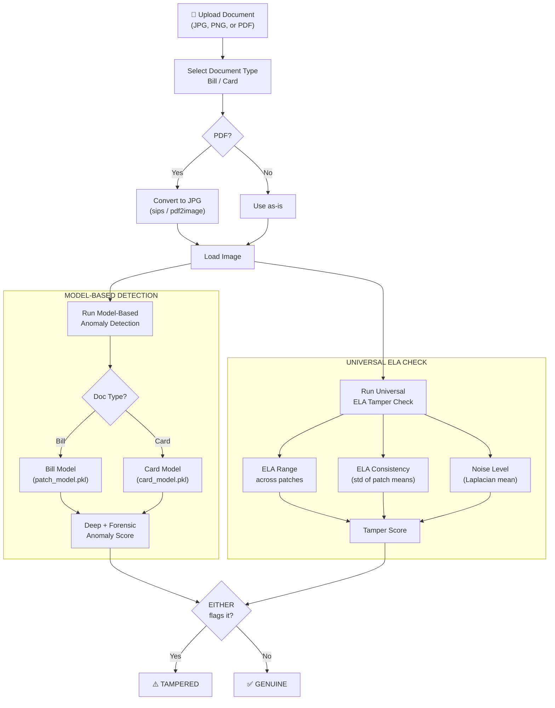
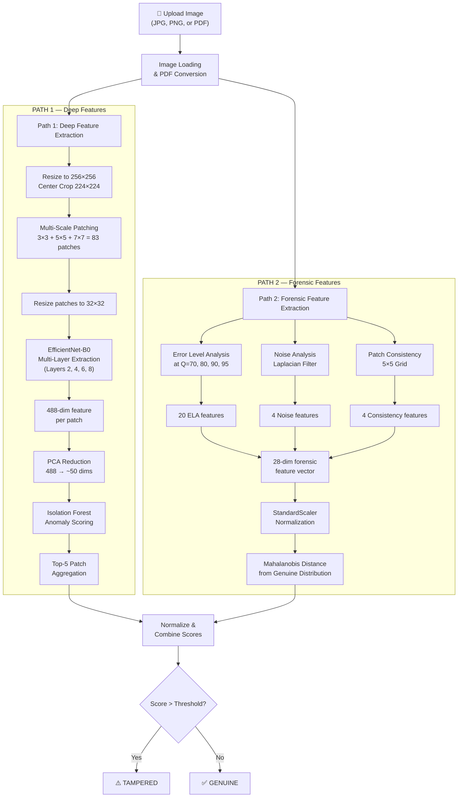
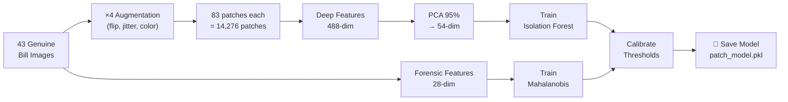
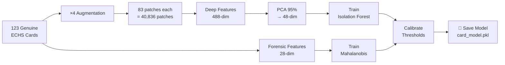

# Bill & Card Fraud Detection System — Technical Documentation

## Table of Contents

1. [System Overview](#system-overview)
2. [Architecture — Dual Model + ELA Safety Net](#architecture--dual-model--ela-safety-net)
3. [Complete Pipeline Flow](#complete-pipeline-flow)
4. [Step-by-Step: What Happens When You Upload a Document](#step-by-step-what-happens-when-you-upload-a-document)
5. [Algorithms & Methods In Detail](#algorithms--methods-in-detail)
6. [Training Pipeline](#training-pipeline)
7. [Model Architecture](#model-architecture)
8. [Performance & Accuracy](#performance--accuracy)
9. [Web Application](#web-application)

---

## System Overview

This system detects **tampered (fraudulent) documents** — both medical bills/prescriptions and ECHS cards/IDs — using a **three-layer detection approach**:

| Layer | What It Does | Algorithm | Scope |
|-------|-------------|-----------|-------|
| **Deep Feature Path** | Analyzes visual content & structure | EfficientNet-B0 → Isolation Forest | Per document type |
| **Forensic Path** | Detects compression artifacts & noise patterns | ELA + Noise Analysis → Mahalanobis Distance | Per document type |
| **Universal ELA Check** | Model-independent tampering detection | ELA range + consistency − noise level | All document types |

### Dual-Model Architecture

The system uses **separate models** for different document types because bills and cards have vastly different visual/forensic profiles:

| Model | Training Data | File | Purpose |
|-------|-------------|------|---------|
| **Bill Model** | 43 genuine bills/prescriptions | `models/patch_model.pkl` | Detects tampered bills with 100% accuracy |
| **Card Model** | 123 genuine ECHS cards/IDs | `models/card_model.pkl` | Verifies ECHS card authenticity |

> [!IMPORTANT]
> Each model is trained only on **genuine** documents of its type. The Isolation Forest and Mahalanobis Distance learn what "normal" looks like and flag anything that deviates.

### Universal ELA Safety Net

Because each model only knows its own document type, a **standalone ELA-based tampering check** runs on every upload regardless of the selected model. This catch-all layer uses:

```
tamper_score = (ela_range / 10) + (ela_consistency / 3) − (noise_mean / 5)
```

If `tamper_score > 2.4`, the document is flagged as tampered — even if the selected model's anomaly detector doesn't catch it.

---

## Architecture — Dual Model + ELA Safety Net



---

## Complete Pipeline Flow



---

## Step-by-Step: What Happens When You Upload a Document

### Step 1 — Document Loading & PDF Conversion
**File:** `app.py → convert_pdf_to_image()`, `bill_preprocessing.py → load_and_preprocess_image()`

- **PDF files** are automatically converted to JPEG images:
  - Primary method: `sips` (macOS built-in, fast)
  - Fallback: `pdf2image` Python library (cross-platform)
- The image is loaded as **RGB** using PIL
- Preprocessing is applied:
  - Resize to **256 × 256** pixels
  - Center crop to **224 × 224** (standard ImageNet input size)
  - Convert to tensor and normalize using **ImageNet statistics**:
    - Mean: `[0.485, 0.456, 0.406]`
    - Std: `[0.229, 0.224, 0.225]`

### Step 2 — Multi-Scale Patch Extraction
**File:** `bill_preprocessing.py → create_multiscale_patches()`

The image is divided into patches at **3 different scales** to capture anomalies at different granularities:

| Grid | Patches | What It Captures |
|------|---------|-----------------|
| **3×3** | 9 large patches | Broad structural anomalies (e.g., entire sections replaced) |
| **5×5** | 25 medium patches | Region-level tampering (e.g., price field edits) |
| **7×7** | 49 fine patches | Pixel-level manipulations (e.g., single digit changes) |

**Total: 83 patches** per image, all resized to **32×32** using bilinear interpolation.

> [!NOTE]
> Multi-scale analysis is crucial because tampering can occur at any granularity — from changing a single digit to replacing entire sections of a document.

### Step 3 — Deep Feature Extraction (Path 1)
**File:** `feature_extractor.py → FeatureExtractor`

Each of the 83 patches is passed through **EfficientNet-B0** (pre-trained on ImageNet). Features are extracted from **4 intermediate layers**:

| Layer Index | Channel Dims | What It Captures |
|-------------|-------------|-----------------|
| Layer 2 | 24 | Low-level edges, textures, noise patterns |
| Layer 4 | 40 | Mid-level shapes, character strokes |
| Layer 6 | 112 | High-level structural patterns |
| Layer 8 (final) | 1280 | Semantic content, document layout |

Each layer's output is **global-average-pooled** to a vector, then all 4 are **concatenated** to form a **488-dimensional feature vector** per patch.

> [!IMPORTANT]
> Multi-layer extraction is critical because tampering artifacts manifest at different abstraction levels. A copied region might look fine semantically (high layers) but have inconsistent texture patterns (low layers).

### Step 4 — PCA Dimensionality Reduction
**File:** `outlier_detector.py → AnomalyDetector.train()`

The 488-dim features are reduced using **PCA** retaining **95% of the explained variance**:
- Bill model: 488 → ~54 dims
- Card model: 488 → ~48 dims

**Why PCA?**
- Removes noise and redundant correlations
- Reduces computational cost of Isolation Forest
- Prevents the "curse of dimensionality"

### Step 5 — Isolation Forest Scoring (Path 1)
**File:** `outlier_detector.py → AnomalyDetector.predict_deep()`

**Isolation Forest** (300 trees) scores each patch. Then **Top-5 aggregation** selects the 5 most anomalous patches and averages their scores.

> [!TIP]
> Top-k aggregation is more robust than simple `max()` (noisy from a single outlier) or `mean()` (dilutes the signal when only a few patches are tampered).

### Step 6 — Error Level Analysis (Path 2)
**File:** `feature_extractor.py → ForensicFeatureExtractor.compute_ela()`

**ELA** detects regions edited after the original save:
1. Re-compress at quality Q → compute pixel-by-pixel difference → amplify by `255 / (100 − Q + 1)`

Computed at **4 quality levels** (Q=70, 80, 90, 95), extracting 5 statistics each (mean, std, max, p95, p99) = **20 ELA features**.

### Step 7 — Noise & Consistency Analysis (Path 2)
**File:** `feature_extractor.py → ForensicFeatureExtractor`

- **Noise Analysis**: Laplacian high-pass filter → 4 features (mean, std, kurtosis, skewness)
- **Patch Consistency**: Measures ELA/noise uniformity across 5×5 grid → 4 features (ELA consistency, noise consistency, ELA range, noise range)

**Total forensic vector: 28 dimensions** (20 ELA + 4 noise + 4 consistency)

### Step 8 — Mahalanobis Distance Scoring (Path 2)
**File:** `outlier_detector.py → AnomalyDetector.predict_forensic()`

The 28-dim vector is scored using **Mahalanobis distance** with **MinCovDet** covariance estimation:

```
D_M(x) = √((x − μ)ᵀ Σ⁻¹ (x − μ))
```

### Step 9 — Score Combination & Decision
**File:** `pipeline.py → score_image()`

Both scores are z-normalized and combined:

```
combined = 0.35 × deep_normalized + 0.65 × forensic_normalized
```

### Step 10 — Universal ELA Tampering Check
**File:** `app.py → compute_ela_tamper_score()`

Runs **independently of the anomaly model** on every upload:

```
tamper_score = (ela_range / 10) + (ela_consistency / 3) − (noise_mean / 5)
```

| Signal | Why It Works |
|--------|-------------|
| **ELA Range** (high) | Tampered regions have different error levels than surrounding areas |
| **ELA Consistency** (high) | Edited patches break the uniformity of the document |
| **Noise Mean** (low) | Tampered images have been re-saved, reducing natural noise |

> [!IMPORTANT]
> The final verdict is: `TAMPERED if (model_score > threshold) OR (ela_tamper_score > 2.4)`. This ensures tampered documents are caught regardless of which model is selected.

### Step 11 — Confidence Score
**File:** `app.py`

The confidence percentage is computed based on the detection source:

| Detection Source | Confidence Calculation |
|-----------------|----------------------|
| Model-flagged | `70% + 30% × margin_above_threshold` (up to 99.9%) |
| ELA-only flagged | `65% + 30% × margin_above_ELA_threshold` (up to 95%) |
| Genuine (passed) | `60% + 40% × margin_below_threshold` (up to 99.9%) |

---

## Training Pipeline

Training only requires **genuine (real) document images** for each document type.

### Bill Model Training

```
python3 -m src.pipeline train --data_dir data/train_genuine --model_path models/patch_model.pkl
```



### Card Model Training

```
python3 -m src.pipeline train --data_dir data/Card --model_path models/card_model.pkl
```



**Augmentation** (training only):
- Random horizontal flip (30% chance)
- Random affine: ±2° rotation, ±2% translation
- Color jitter: ±10% brightness/contrast, ±5% saturation

---

## Model Architecture

```
┌─────────────────────────────────────────────────────┐
│                  SAVED MODEL FILES                   │
│    models/patch_model.pkl  &  models/card_model.pkl  │
├─────────────────────────────────────────────────────┤
│                                                      │
│  ┌──────────────────────────────────────────────┐   │
│  │  Deep Path                                     │   │
│  │  ├─ PCA (488 → ~50 dims, 95% variance)       │   │
│  │  └─ Isolation Forest (300 trees)              │   │
│  └──────────────────────────────────────────────┘   │
│                                                      │
│  ┌──────────────────────────────────────────────┐   │
│  │  Forensic Path                                 │   │
│  │  ├─ StandardScaler (28 features)              │   │
│  │  └─ MinCovDet Covariance Estimator            │   │
│  └──────────────────────────────────────────────┘   │
│                                                      │
│  ┌──────────────────────────────────────────────┐   │
│  │  Calibration Statistics                        │   │
│  │  ├─ Deep score mean/std                       │   │
│  │  ├─ Forensic score mean/std                   │   │
│  │  ├─ Image-level score mean/std                │   │
│  │  └─ Combined threshold = μ + 2σ              │   │
│  └──────────────────────────────────────────────┘   │
│                                                      │
│  EfficientNet-B0 is NOT saved — it loads from       │
│  torchvision at startup (pre-trained ImageNet)       │
│                                                      │
│  ┌──────────────────────────────────────────────┐   │
│  │  Universal ELA Check (in app.py, not in model)│   │
│  │  ├─ Threshold = 2.4                           │   │
│  │  └─ Formula: range/10 + consist/3 − noise/5  │   │
│  └──────────────────────────────────────────────┘   │
│                                                      │
└─────────────────────────────────────────────────────┘
```

---

## Performance & Accuracy

### Bill Model (`patch_model.pkl`)

| Metric | Value |
|--------|-------|
| Training Images | 43 genuine bills |
| Genuine Accuracy | **97.7%** (42/43) |
| Tampered Detection | **100%** (28/28) |
| False Positives | 1 |
| False Negatives | 0 |

### Card Model (`card_model.pkl`)

| Metric | Value |
|--------|-------|
| Training Images | 123 genuine ECHS cards |
| Genuine Accuracy | **100%** (123/123) |
| Tampered Detection | Via universal ELA check |

### Universal ELA Check

| Metric | Value |
|--------|-------|
| Tampered Detection | **92.9%** (26/28) |
| Genuine Pass Rate | **93.4%** (142/152) |
| Overall Accuracy | **93.3%** |

### Combined System (Model + ELA)

| Test Case | Mode | Result |
|-----------|------|--------|
| Tampered image → Bill mode | Bill | ✅ TAMPERED (99.9%) |
| Tampered image → Card mode | Card | ✅ TAMPERED (77.9%) — caught by ELA |
| Genuine bill → Bill mode | Bill | ✅ GENUINE (71.0%) |
| Genuine card → Card mode | Card | ✅ GENUINE (76.3%) |

### Score Distribution (Bill Model)

```
GENUINE images:  scores range from -1.30 to 1.90  (threshold = 1.72)
TAMPERED images: scores range from 143,139 to 683,804

                                        ↓ threshold
  GENUINE  ────|████████████████████|─── · ─────────────────
  TAMPERED ─────────────────────────────────|████████████████
          -2    -1     0     1     2    ...  100K   500K   700K
```

> [!NOTE]
> The forensic features create a **massive separation** between genuine and tampered bill images, making the bill model extremely reliable. The card model relies on the universal ELA check for tampered detection until tampered card training data becomes available.

---

## Web Application

### UI Features

- **Document Type Selector** — Toggle between "Bill / Prescription" and "ECHS Card / ID" to route to the appropriate model
- **Drag & Drop Upload** — Supports JPG, PNG, and PDF files
- **PDF Conversion** — PDFs are automatically converted to images server-side, with a placeholder shown during processing and the converted image displayed after analysis
- **Real-Time Analysis** — Animated loading steps during processing
- **Visual Results** — Confidence ring, score breakdown (deep + forensic + combined), and threshold comparison
- **Dark Theme** — Premium dark UI with animated background and glassmorphism effects

### API Endpoints

| Endpoint | Method | Description |
|----------|--------|-------------|
| `GET /` | GET | Serve the web UI |
| `GET /api/models` | GET | List available models and their status |
| `POST /api/analyze` | POST | Analyze a document (accepts `file` + `doc_type` form data) |

### Running the Server

```bash
cd bill_fraud_system
python3 app.py
# Server starts at http://localhost:8000
```

### Processing Time

| Stage | Time |
|-------|------|
| Deep feature extraction | ~2s |
| Forensic feature extraction | ~0.5s |
| ELA tamper check | ~0.5s |
| **Total** | **~3s per image** |
