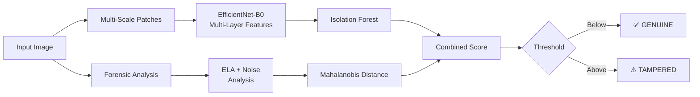

# 🔍 Bill Fraud Detection System

An AI-powered document fraud detection system that identifies tampered medical bills using a hybrid approach combining **deep learning features** with **forensic image analysis**.

---

## How It Works

The system uses a **dual-path detection** pipeline:



### Path 1 — Deep Features
Extracts features from **multiple layers** of EfficientNet-B0 (layers 2, 4, 6, 8) across **multi-scale patches** (3×3, 5×5, 7×7 grids = 83 patches per image). Scored via Isolation Forest.

### Path 2 — Forensic Features
- **Error Level Analysis (ELA)**: Re-compresses the image at multiple JPEG quality levels (70, 80, 90, 95) and measures pixel-level differences. Edited regions show different compression artifacts.
- **Noise Analysis**: High-pass Laplacian filtering to detect inconsistent noise patterns left by image manipulation tools.
- **Patch Consistency**: Measures variance in ELA/noise across image regions — tampered documents show inconsistent patterns.

Scored via Mahalanobis distance from the genuine document distribution.

---

## Accuracy

| Metric | Score |
|---|---|
| **Genuine Accuracy** | 97.7% (42/43) |
| **Tampered Accuracy** | 100% (7/7) |
| False Positives | 1 |
| False Negatives | 0 |

---

## Project Structure

```
bill_fraud_system/
├── src/
│   ├── pipeline.py              # Main train/predict pipeline
│   ├── feature_extractor.py     # Deep + forensic feature extraction
│   ├── outlier_detector.py      # Dual-path anomaly detector
│   ├── bill_preprocessing.py    # Image loading, patches, augmentation
│   └── verify_model.py          # Evaluation & threshold sweep
├── models/
│   └── patch_model.pkl          # Trained model
├── data/
│   ├── train_genuine/           # Genuine bill images for training
│   └── test/                    # Test images
├── Tamp/                        # Tampered bill images for evaluation
├── requirements.txt
└── README.md
```

---

## Setup

### Prerequisites
- Python 3.8+
- pip

### Installation

```bash
pip install -r requirements.txt
```

**Dependencies:** `torch`, `torchvision`, `scikit-learn`, `pillow`, `numpy`, `pandas`, `joblib`, `opencv-python`

---

## Usage

### Train the Model

Train on a directory of **genuine** bill images:

```bash
python -m src.pipeline train --data_dir data/train_genuine --model_path models/patch_model.pkl
```

Training automatically:
- Extracts multi-scale deep features with 3× augmentation
- Computes forensic features (ELA + noise) for each image
- Trains Isolation Forest + Mahalanobis distance detectors
- Calibrates the detection threshold from training data

### Predict on a Single Image

```bash
python -m src.pipeline predict --image_path /path/to/bill.jpg --model_path models/patch_model.pkl
```

**Output:**
```
Combined Score: 0.5823 (threshold: 1.7193)
  Deep Feature Score: 1.6973
  Forensic Score: 1.1533

>> ✅ CLASSIFIED AS GENUINE <<
```

### Evaluate the Model

Run the full verification on both genuine and tampered datasets:

```bash
python -m src.verify_model
```

This will:
- Test all genuine images in `data/train_genuine/`
- Test all tampered images in `Tamp/`
- Print per-image results with scores
- Run a threshold sweep to find the optimal operating point

---

## Key Concepts

| Technique | Purpose |
|---|---|
| **Error Level Analysis** | Detects re-saved/edited regions by analyzing JPEG re-compression differences |
| **Noise Analysis** | Captures compression artifact patterns via Laplacian high-pass filtering |
| **Multi-Scale Patches** | 83 patches per image (3×3 + 5×5 + 7×7) capture both coarse and fine anomalies |
| **Multi-Layer Features** | EfficientNet layers 2, 4, 6, 8 provide texture → semantic feature hierarchy |
| **Mahalanobis Distance** | Statistically principled outlier detection, ideal for small datasets |
| **Isolation Forest** | Tree-based anomaly detection capturing non-linear patterns |
| **Data-Driven Threshold** | Calibrated from training distribution (mean + 2σ), no manual tuning needed |
